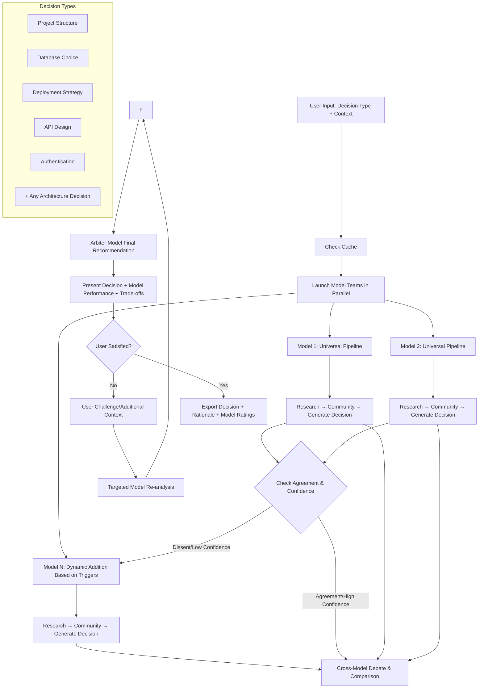

# ADR-001: Universal AI Architecture Decision Platform

## Status
Revised (v3.0 - September 2025)

## Context
We want to build a CLI platform that helps developers make any architectural decision by having multiple AI models compete through analysis pipelines. Starting with project structures, the platform can handle any architectural choice: databases, deployment strategies, API designs, authentication patterns, cloud providers, etc.

**Key Innovation**: Model-vs-Model competition platform that evaluates which OpenRouter models provide the best architectural guidance across different domains and decision types.

## Decision

### Core Architecture: Universal Decision Engine
- **Multiple Model Teams** each running complete analysis pipelines for any architectural decision
- **Cross-Model Debate System** where team results compete across decision domains *(Optional in 001; enable via flag)*
- **Model Evaluation Framework** to rate which models excel at different architectural decision types
- **SQLite caching** to avoid redundant API calls and enable fast iteration across all decision types
- **Challenge/refinement loop** allowing users to contest recommendations
- **Pluggable Decision Types** easily add new architectural decision categories

### Individual LLM Competition Design
Each model operates as an independent competitor with clear attribution and performance tracking:

1. **Universal Pipeline Structure** (each model runs independently):
   - **Research Phase**: Domain-specific data analysis (GitHub, docs, benchmarks, case studies)
   - **Community Phase**: Social sentiment analysis (Reddit, StackOverflow, Twitter, forums)
   - **Generation Phase**: Decision synthesis with pros/cons, trade-offs, and recommendations

2. **Dynamic Model Competition** (1 model = 1 team for clear attribution):
   - **Default N=2**: Two models compete (fast, cost-effective baseline)
   - **Auto-escalation to N=3+**: Additional models join when dissent/confidence triggers fire:
     - **High dissent**: Low agreement between top recommendations (Kendall-τ below threshold)
     - **Low confidence**: Model self-scores < threshold or weak evidence density
     - **Novel query**: Cache miss on domain + decision type combination
     - **User stakes**: High-stakes mode or increased budget/time ceiling
   - **Configurable Models**: Any OpenRouter models (GPT-4o, Claude-3.5, Llama-70B, Grok, DeepSeek, Gemini, etc.)
   - **Budget Guardrails**: User-set caps for max models and max tokens

3. **Final Arbiter**: Environment-configurable model makes final recommendation with transparency on why it chose specific arguments

**Key Terms:**
- **Self-confidence**: Model-reported score in [0–1] derived from rationale rubric; default threshold 0.6
- **Agreement (Kendall-τ)**: Computed over ranked top-3 options; dissent = τ < 0.3

### Decision Types (Extensible Plugin System)
- **Project Structure**: File/folder organization, build systems, dependency management
- **Database Architecture**: SQL vs NoSQL vs Graph, specific database selection
- **Deployment Strategy**: Cloud vs On-premise, Containers vs Serverless vs VMs
- **API Design**: REST vs GraphQL vs gRPC, versioning strategies
- **Authentication**: OAuth vs JWT vs Sessions, identity providers
- **Frontend Architecture**: SPA vs MPA, framework selection, state management
- **Testing Strategy**: Unit vs Integration vs E2E, framework selection
- **Monitoring & Observability**: Logging, metrics, tracing tool selection
- **Security Patterns**: Zero-trust, defense-in-depth, compliance frameworks
- *(Easy to add new decision types through configuration)*

### Technical Decisions

#### Evaluation & Orchestration Policy

**Team Structure:**
- **Single Model per Team**: Each team = one model for clean attribution and performance tracking
- **Dynamic Team Count**: Start N=2, escalate to N=3-4 on dissent/confidence/novelty triggers
- **Configurable Arbiter**: Distinct model (via ARCHGURU_ARBITER_MODEL) makes final decisions

**Minimal Configuration Example (001):**
```yaml
orchestration:
  default_teams: 2
  max_teams: 4
  escalation_triggers:
    min_agreement_kendall_tau: 0.3
    min_self_confidence: 0.6
    cache_miss: true
  arbiter_model_env: ARCHGURU_ARBITER_MODEL

presets:
  database-architecture:
    defaults: ["openai/gpt-4o", "anthropic/claude-3.5-sonnet"]
    research_depth: high
    cost_ceiling_usd: 0.40
  frontend-framework:
    defaults: ["anthropic/claude-3.5-sonnet", "meta-llama/llama-3.1-70b"]
    research_depth: medium
    cost_ceiling_usd: 0.25
```

#### Individual Model Competition Strategy
- **OpenRouter API** as the unified interface for all model providers
- **Environment-Configurable Models**: Set competing models via ARCHGURU_MODELS environment variable
- **Dynamic Scaling**: Start with 2 models, auto-escalate to 3-4 (001 cap) based on dissent/confidence triggers
- **Clear Attribution**: Each model tracked individually for performance analytics
- **Cost-Performance Balance**: Mix premium and efficient models based on user preference
- **Per-Model, Per-Decision-Type Rating**: Track specialization patterns (e.g., "GPT-4 excels at database decisions, Claude-3.5 at API design") *(Optional in 001; TrueSkill via flag)*
- **Intelligent Model Selection**: Prefer models with high historical performance for specific decision types
- **Fallback Strategy**: Graceful degradation when models are unavailable

#### Data Sources & Caching
- **GitHub API** for repository analysis (cached in SQLite)
- **Reddit/StackOverflow APIs** for community sentiment (cached)
- **TTL-based cache expiration** (7 days for repo data, 3 days for community data)
- **Versioned Cache Keys**: Include model, prompt template version, and pipeline version for cache invalidation

```text
cache_key = sha256(
  decision_type + "\n" +
  normalize(context) + "\n" +
  model + "\n" +
  prompt_template_version + "\n" +
  pipeline_version
)
```

#### Output Format
- **No code generation in 001; structure + explanations only**
- **CLI with Rich formatting** and optional Markdown export
- **Mermaid diagrams** for visualizing project architecture

#### Extensibility
- **Plugin architecture** for adding new languages/project types
- **Configuration-driven agents** to easily modify behavior
- **Modular debate strategies** (consensus, majority vote, weighted opinion)

**Decision-Type Plugin Contract:**
```python
class DecisionType(Protocol):
    name: str
    def gather_context(self, user_args) -> dict: ...
    def research_plan(self, context) -> list[ToolCall]: ...
    def evaluate(self, team_output) -> dict: ...  # structured rationale
```

**Structured Rationale Schema:**
```json
{
  "claims": [{"text": "...", "supporting_sources": ["url1", "url2"]}],
  "tradeoffs": [{"axis":"cost vs performance","analysis":"..."}],
  "risks": [{"severity":"high","mitigation":"..."}],
  "recommendation": {"summary":"...", "steps":["..."]},
  "citations": [{"url":"...", "type":"doc|benchmark|repo"}]
}
```

### Universal User Experience Flow


## Consequences

### Positive
- **Universal Architecture Intelligence**: Platform to systematically compare AI models across all architectural decision types
- **Cross-Domain Model Insights**: Learn which models excel at different architectural domains (databases vs deployment vs API design)
- **Competitive Model Intelligence**: Models improve through competition across diverse architectural challenges
- **Decision Support**: Get multiple expert perspectives on any architectural choice
- **Infinite Extensibility**: Add any new architectural decision type through simple configuration
- **Knowledge Compound Effect**: Model performance data improves across all decision types
- **Fast subsequent runs**: Universal caching works across all decision domains

### Risks & Mitigation
- **API Cost Management**: Multiple models per request increases costs - mitigate with intelligent caching and model tiers
- **Cross-Model Debate Complexity**: Ensuring models actually engage with each other's arguments
- **Model Availability**: OpenRouter model downtime affects team composition - implement graceful degradation
- **Evaluation Bias**: Avoid favoring models that produce longer or more verbose responses
- **Cache Invalidation**: Model updates may change responses - implement smart cache versioning

### Success Criteria (001)
- **N=2 end-to-end decision**: <2 minutes
- **Escalated N=3-4**: <3.5 minutes
- **Cached**: <30 seconds

### Analytics & Evaluation Infrastructure

**Required Tables (001):**
```sql
-- One row per user request
CREATE TABLE decisions(
  id TEXT PRIMARY KEY,
  created_at TEXT,
  decision_type TEXT,
  context_hash TEXT,
  stakes TEXT, -- low/med/high
  budget_cents INT,
  version TEXT
);

-- One row per team/model run
CREATE TABLE team_runs(
  id TEXT PRIMARY KEY,
  decision_id TEXT,
  team_id TEXT,
  model TEXT,
  tokens_in INT, tokens_out INT, cost_cents INT, latency_ms INT,
  self_confidence REAL, evidence_count INT,
  rationale_json TEXT
);
```

**Optional Tables (documented but not required for 001):**
```sql
-- Pairwise judgments for TrueSkill/Elo
CREATE TABLE pairwise_judgments(
  id TEXT PRIMARY KEY,
  decision_id TEXT,
  winner_team_id TEXT,
  loser_team_id TEXT,
  judge_model TEXT,
  decision_type TEXT,
  draw BOOLEAN,
  rubric_scores_json TEXT
);

-- Per-model, per-type rolling rating
CREATE TABLE model_skill(
  model TEXT, decision_type TEXT,
  mu REAL, sigma REAL, updated_at TEXT,
  PRIMARY KEY(model, decision_type)
);
```

**Judge Protocol:**
- **Pairwise comparisons** with draw support for unbiased evaluation
- **Judge normalization** via z-scoring to correct for judge bias
- **Structured rubrics** with evidence quality, trade-off clarity, risk assessment dimensions

**Model Personality Tracking:** *(Optional in 001; Personality Profiles via flag)*
- Log pattern frequencies (serverless, microservices, GraphQL adoption)
- Track cost vs performance recommendation tendencies
- Measure solution complexity preferences for future personality profiles

**Observability Metrics (001 Core):**
```
archguru.cache.hit, .miss
archguru.team.latency_ms, .cost_cents
archguru.arbiter.select
```

**Optional Metrics (enable via flags):**
```
archguru.judge.preference (labels: winner, loser, type, judge)
archguru.debate.rounds
```

### Business Value
- **Universal Architecture Consultant**: Replace expensive architecture consulting with AI model competition
- **Model Selection Intelligence**: Learn which AI models excel at which types of architectural thinking
- **Decision Confidence**: Multiple model agreement provides confidence in architectural choices
- **Competitive Advantage**: Unique platform approach with no direct competitors
- **Scalable Expertise**: One platform covers all architectural decision making needs

### Environment Configuration

**Configuration (001):**
```env
# Required
OPENROUTER_API_KEY=your_key_here
ARCHGURU_MODELS=openai/gpt-4o,anthropic/claude-3.5-sonnet
ARCHGURU_ARBITER_MODEL=openai/gpt-4o

# Core settings
ARCHGURU_MAX_TEAMS=4
ARCHGURU_CACHE_TTL_REPO_DAYS=7
ARCHGURU_CACHE_TTL_COMMUNITY_DAYS=3

# Optional features (disabled by default in 001)
ARCHGURU_ENABLE_DEBATE=false
ARCHGURU_ENABLE_BRIDGE=false
ARCHGURU_DYNAMIC_ESCALATION=false
```

**Cross-Domain Bridge Pass:**
- Optional bridge agent between team outputs and arbitration
- Handles decisions spanning multiple types (DB ↔ API ↔ deployment)
- Analyzes cross-impacts and conflicts before final arbitration
- **Disabled by default in 001; requires ARCHGURU_ENABLE_BRIDGE=true**

## Implementation Priority
1. **Individual Model Competition**: Single-model teams with dynamic scaling triggers
2. **Analytics Infrastructure**: Core tables for decisions, team runs, and pairwise judgments
3. **Decision-Type Presets**: Default model combinations and escalation thresholds per type
4. **Structured Rationale Schema**: Standardized output format for claims, trade-offs, and citations
5. **Judge Protocol**: Pairwise comparison framework for model evaluation
6. **Model Team Infrastructure**: LangGraph pipelines for each model running full research→community→generation
7. **Cross-Model Debate System**: Framework for models to analyze and respond to each other's outputs
8. **Model Evaluation Framework**: TrueSkill ratings and personality profiling
9. **Caching & Optimization**: Versioned cache keys and intelligent model selection
10. **CLI Interface**: Rich output showing model comparisons and final arbitration

## Success Metrics
- **Cross-Domain Model Performance**: Track which models excel at which architectural decision types
- **Decision Quality**: Measure user satisfaction with recommendations across different decision domains
- **Platform Adoption**: Track usage growth across different architectural decision types
- **Model ROI**: Optimize quality-to-cost ratio for model combinations across all decisions
- **Coverage Breadth**: Successfully handle architectural decisions across all major technology domains

## Individual Model Rating System

### Performance Metrics (Per Model, Per Decision Type)

**Outcome Signals:**
- **User Acceptance Rate**: Accepted as-is / accepted with edits / rejected
- **Challenge Survival**: After challenge/refinement loop, did this model's answer remain the basis?

**Evidence & Rigor:**
- **Evidence Density**: # of unique, relevant sources cited; proportion of primary sources
- **Traceability Quality**: How well rationales tie to evidence (rubric-scored 1-5)

**Comparative Signals:**
- **Debate Win Rate**: Bradley-Terry/Elo/TrueSkill over pairwise "which is better" judgments
- **Consensus Contribution**: How often model's key points appear in arbiter's final rationale

**Robustness & Reliability:**
- **Self-Consistency**: Re-ask with small perturbations; measure semantic stability
- **Refutation Resistance**: Does model catch/withstand adversarial critiques?

**Efficiency:**
- **Latency, tokens, $ cost** (normalized by task difficulty)

### Core Metrics (001)

**Enforced in 001:**
- **Acceptance Rate**: Accepted as-is / accepted with edits / rejected
- **Cost/Latency**: Normalized efficiency metrics

**Future Evaluation (003+):**
```
score_model(decision_type, time_window) =
  0.30 * pref_win_rate +
  0.20 * acceptance_rate +
  0.15 * evidence_density +
  0.10 * traceability +
  0.10 * robustness +
  0.10 * consensus_contrib -
  0.05 * cost_norm
```

## Open Questions
- How to calibrate pairwise preference judgments across different decision types?
- Should we implement domain-specific model presets while maintaining dynamic escalation?
- How to handle cross-domain architectural decisions that span multiple decision types?
- Can we develop "model personality profiles" showing architectural philosophy preferences?
- How to optimize weekly re-ranking of model performance using TrueSkill?
- Should cache-aware specialization influence dynamic model selection?

## Future Expansion Possibilities
- **Team Architecture Decisions**: Handle decisions requiring multiple stakeholder perspectives
- **Enterprise Integration**: API for integration with existing architecture tools and processes
- **Real-time Learning**: Continuous improvement based on decision outcomes and user feedback
- **Architecture Pattern Mining**: Discover new architectural patterns from cross-model analysis
- **Compliance Integration**: Incorporate regulatory and compliance constraints into decision making