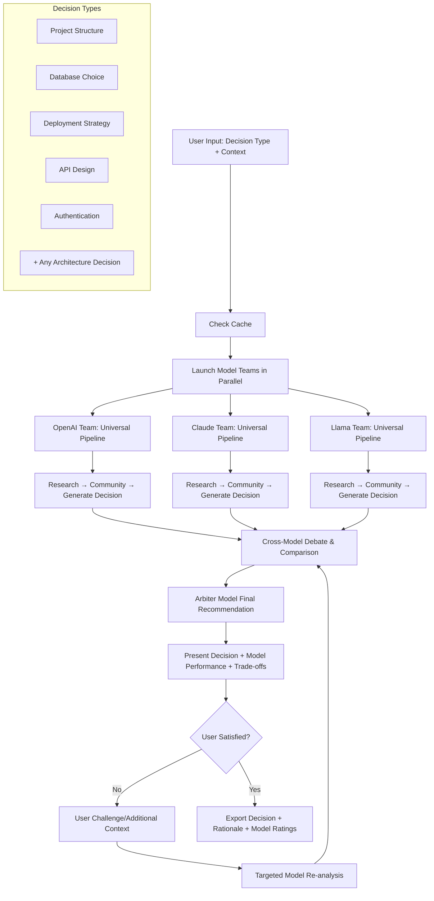

# ADR-001: Universal AI Architecture Decision Platform

## Status
Revised (v3.0 - September 2025)

## Context
We want to build a CLI platform that helps developers make any architectural decision by having multiple AI models compete through comprehensive analysis pipelines. Starting with project structures, the platform can handle any architectural choice: databases, deployment strategies, API designs, authentication patterns, cloud providers, etc.

**Key Innovation**: Model-vs-Model competition platform that evaluates which OpenRouter models provide the best architectural guidance across different domains and decision types.

## Decision

### Core Architecture: Universal Decision Engine
- **Multiple Model Teams** each running complete analysis pipelines for any architectural decision
- **Cross-Model Debate System** where team results compete across decision domains
- **Model Evaluation Framework** to rate which models excel at different architectural decision types
- **SQLite caching** to avoid redundant API calls and enable fast iteration across all decision types
- **Challenge/refinement loop** allowing users to contest recommendations
- **Pluggable Decision Types** easily add new architectural decision categories

### Model Team Design
Each model team runs the complete pipeline for any architectural decision:

1. **Universal Pipeline Structure** (adaptable to any decision type):
   - **Research Phase**: Domain-specific data analysis (GitHub, docs, benchmarks, case studies)
   - **Community Phase**: Social sentiment analysis (Reddit, StackOverflow, Twitter, forums)
   - **Generation Phase**: Decision synthesis with pros/cons, trade-offs, and recommendations

2. **Competing Model Teams** (same across all decision types):
   - **OpenAI Team**: GPT-4o analyzing the architectural decision
   - **Claude Team**: Claude-3.5-Sonnet analyzing the architectural decision
   - **Llama Team**: Llama-3.1-70B analyzing the architectural decision
   - *(Easily extensible to new OpenRouter models)*

3. **Final Arbiter**: Configurable model makes final recommendation considering all team analyses and cross-model debate

### Decision Types (Extensible Plugin System)
- **Project Structure**: File/folder organization, build systems, dependency management
- **Database Architecture**: SQL vs NoSQL vs Graph, specific database selection
- **Deployment Strategy**: Cloud vs On-premise, Containers vs Serverless vs VMs
- **API Design**: REST vs GraphQL vs gRPC, versioning strategies
- **Authentication**: OAuth vs JWT vs Sessions, identity providers
- **Frontend Architecture**: SPA vs MPA, framework selection, state management
- **Testing Strategy**: Unit vs Integration vs E2E, framework selection
- **Monitoring & Observability**: Logging, metrics, tracing tool selection
- **Security Patterns**: Zero-trust, defense-in-depth, compliance frameworks
- *(Easy to add new decision types through configuration)*

### Technical Decisions

#### Model Selection Strategy
- **OpenRouter API** as the unified interface for all model providers
- **Multi-Model Competition**: 3+ models running identical workflows for comparison
- **Cost-Performance Balance**: Mix of premium models (GPT-4o, Claude-3.5) and efficient models (GPT-4o-mini, Claude-3-Haiku)
- **Fallback Strategy**: Graceful degradation when models are unavailable
- **Model Evaluation**: Track which models provide better architecture recommendations over time

#### Data Sources & Caching
- **GitHub API** for repository analysis (cached in SQLite)
- **Reddit/StackOverflow APIs** for community sentiment (cached)
- **TTL-based cache expiration** (7 days for repo data, 3 days for community data)

#### Output Format
- **Folder/file structure only** with explanations (no boilerplate code)
- **CLI with Rich formatting** and optional Markdown export
- **Mermaid diagrams** for visualizing project architecture

#### Extensibility
- **Plugin architecture** for adding new languages/project types
- **Configuration-driven agents** to easily modify behavior
- **Modular debate strategies** (consensus, majority vote, weighted opinion)

### Universal User Experience Flow

## Consequences

### Positive
- **Universal Architecture Intelligence**: First platform to systematically compare AI models across all architectural decision types
- **Cross-Domain Model Insights**: Learn which models excel at different architectural domains (databases vs deployment vs API design)
- **Competitive Model Intelligence**: Models improve through competition across diverse architectural challenges
- **Comprehensive Decision Support**: Get multiple expert perspectives on any architectural choice
- **Infinite Extensibility**: Add any new architectural decision type through simple configuration
- **Knowledge Compound Effect**: Model performance data improves across all decision types
- **Fast subsequent runs**: Universal caching works across all decision domains

### Risks & Mitigation
- **API Cost Management**: Multiple models per request increases costs - mitigate with intelligent caching and model tiers
- **Cross-Model Debate Complexity**: Ensuring models actually engage with each other's arguments
- **Model Availability**: OpenRouter model downtime affects team composition - implement graceful degradation
- **Evaluation Bias**: Avoid favoring models that produce longer or more verbose responses
- **Cache Invalidation**: Model updates may change responses - implement smart cache versioning

### Performance Targets
- **Initial run**: <3 minutes for any new architectural decision (3 models × full pipeline)
- **Cached run**: <45 seconds for previously analyzed decision contexts
- **Model comparison**: <1 minute for debate + arbitration phases
- **Storage**: <500MB SQLite database after analyzing 1000+ architectural decisions across multiple domains
- **Cross-decision learning**: Model performance insights transfer between decision types

### Business Value
- **Universal Architecture Consultant**: Replace expensive architecture consulting with AI model competition
- **Model Selection Intelligence**: Learn which AI models excel at which types of architectural thinking
- **Decision Confidence**: Multiple model agreement provides enterprise-grade confidence in architectural choices
- **Competitive Advantage**: Unique platform approach with no direct competitors
- **Scalable Expertise**: One platform covers all architectural decision making needs

## Implementation Priority
1. **Model Team Infrastructure**: LangGraph pipelines for each model running full research→community→generation
2. **Cross-Model Debate System**: Framework for models to analyze and respond to each other's outputs
3. **Model Evaluation Framework**: Rating and comparison system for model performance
4. **Caching & Optimization**: Smart caching to manage multi-model costs
5. **CLI Interface**: Rich output showing model comparisons and final arbitration

## Success Metrics
- **Cross-Domain Model Performance**: Track which models excel at which architectural decision types
- **Decision Quality**: Measure user satisfaction with recommendations across different decision domains
- **Platform Adoption**: Track usage growth across different architectural decision types
- **Model ROI**: Optimize quality-to-cost ratio for model combinations across all decisions
- **Coverage Breadth**: Successfully handle architectural decisions across all major technology domains

## Open Questions
- Which models should be default competitors across all decision types? (Start with GPT-4o vs Claude-3.5 vs Llama-3.1?)
- How to weight model expertise differently for different architectural domains?
- Should we allow domain-specific model teams (e.g., different models for database vs deployment decisions)?
- How to handle cross-domain architectural decisions that span multiple decision types?
- Can we develop "model personality profiles" showing which models favor which architectural philosophies?

## Future Expansion Possibilities
- **Team Architecture Decisions**: Handle decisions requiring multiple stakeholder perspectives
- **Enterprise Integration**: API for integration with existing architecture tools and processes
- **Real-time Learning**: Continuous improvement based on decision outcomes and user feedback
- **Architecture Pattern Mining**: Discover new architectural patterns from cross-model analysis
- **Compliance Integration**: Incorporate regulatory and compliance constraints into decision making